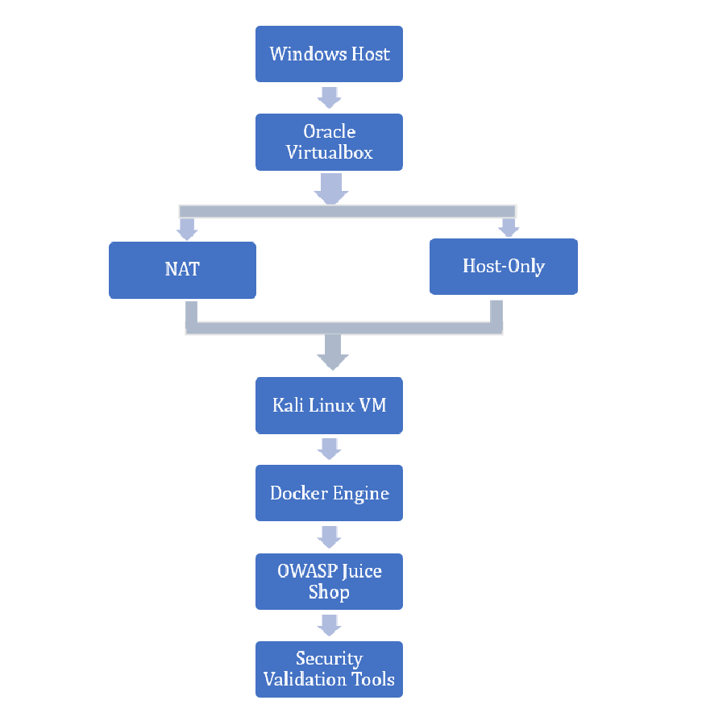

# Personal Cybersecurity Lab

A practical cybersecurity laboratory built using VirtualBox, Kali Linux, Docker, and OWASP Juice Shop.

## Project Objective

Build an isolated cybersecurity lab for learning and practicing:

- Virtualization
- Containerization
- Network Analysis
- Web Application Security
- Traffic Monitoring

---

## Technologies Used

- Oracle VirtualBox
- Kali Linux
- Docker
- OWASP Juice Shop
- Nmap
- Burp Suite Community Edition
- Wireshark

---

## Lab Architecture



---

## Project Workflow

1. Configure VirtualBox
2. Install Kali Linux
3. Configure NAT + Host-Only Networking
4. Install Docker
5. Deploy OWASP Juice Shop
6. Verify Connectivity
7. Perform Nmap Scan
8. Analyze HTTP Traffic using Burp Suite
9. Capture Network Packets using Wireshark

---

## Project Report

The complete internship report is available in:

```
report/
```

---

## Learning Outcomes

- Virtual Machine Configuration
- Docker Deployment
- Web Application Hosting
- Network Scanning
- HTTP Traffic Analysis
- Packet Capture
- Secure Lab Design

---

## Disclaimer

OWASP Juice Shop is intentionally vulnerable and has been deployed **only inside an isolated virtual lab** for educational purposes.
